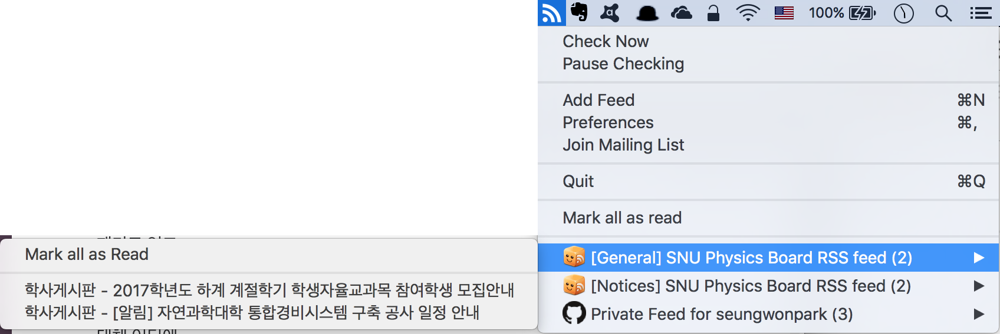

# 서울대 물리천문학부 [게시판](http://phya.snu.ac.kr/xe/underbbs) rss / SNU phya [board](http://phya.snu.ac.kr/xe/underbbs) rss

## Service will be terminated after 2018 fall. [Read more](https://github.com/seungwonpark/SNU_physics_board_rss/wiki/%EC%84%9C%EB%B9%84%EC%8A%A4-%EC%A2%85%EB%A3%8C-%EC%95%88%EB%82%B4---Announcement-about-service-termination)

Source code of [SNU Physics Board RSS](http://swpark.ddns.net/rss/physics).

Based on Python3.

Pull requests are always welcome!

